# AstrBot TTS 服务器插件

通过 API 调用远程 TTS 服务器进行语音合成，支持角色选择和参考音频切换。

---

## 网站地址

**TTS 服务平台**: https://benxianhenl.cn/

---

## 使用教程

### 第一步：注册账户

1. 打开网站 https://benxianhenl.cn/
2. 点击右上角的 **"注册"** 按钮
3. 填写手机号和密码完成注册

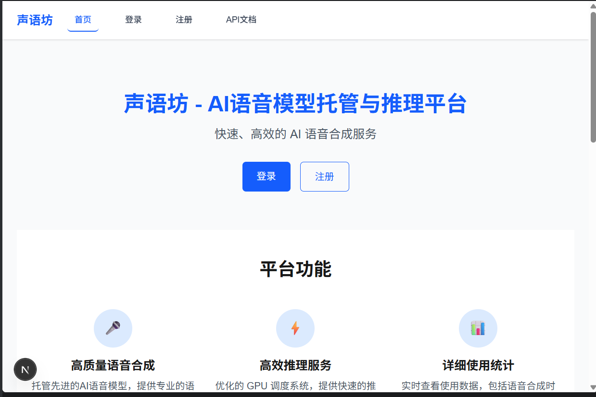

---

### 第二步：创建角色

1. 登录后进入 **"控制台"** 页面
2. 点击 **"创建角色"** 按钮
3. 填写角色名称和描述
4. 选择模型版本（GPT 模型和 SoVITS 模型）

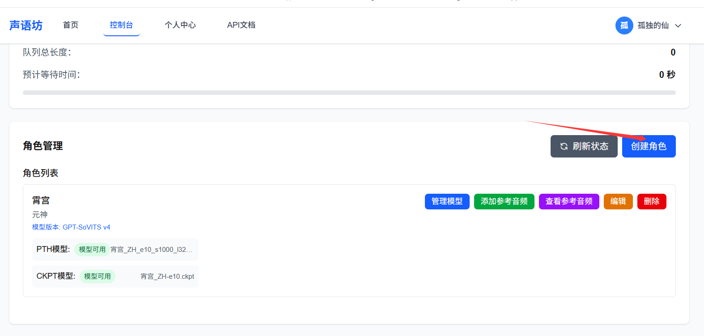

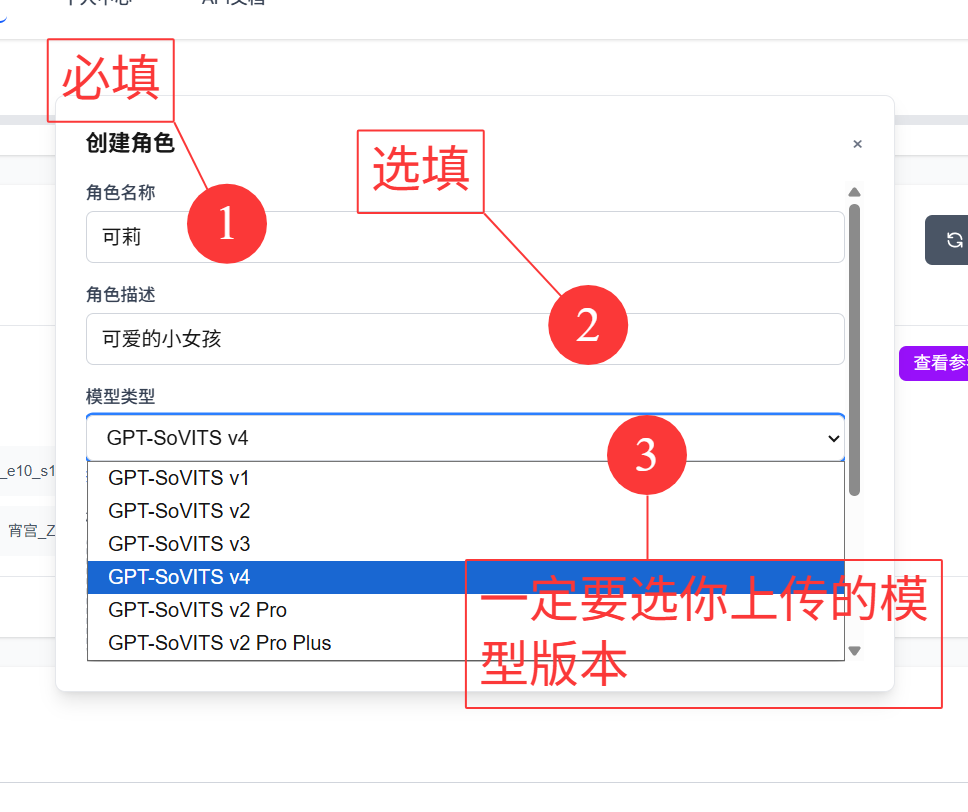

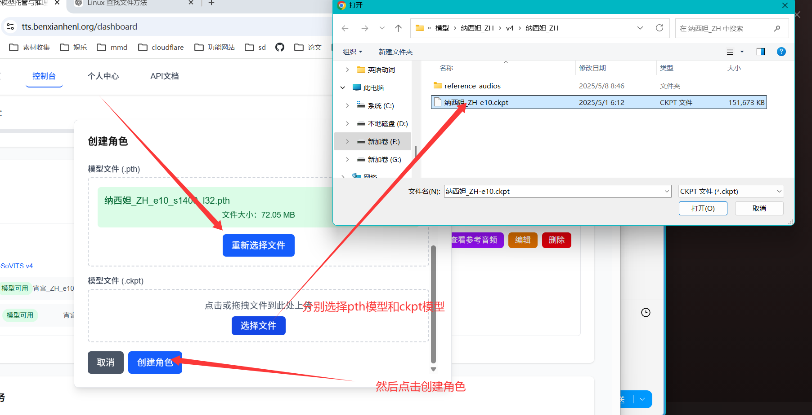

---

### 第三步：上传参考音频

1. 进入角色的 **"参考音频"** 标签页
2. 点击 **"上传参考音频"** 按钮
3. 选择音频文件（支持 wav 格式）
4. 填写音频名称和对应的文本内容

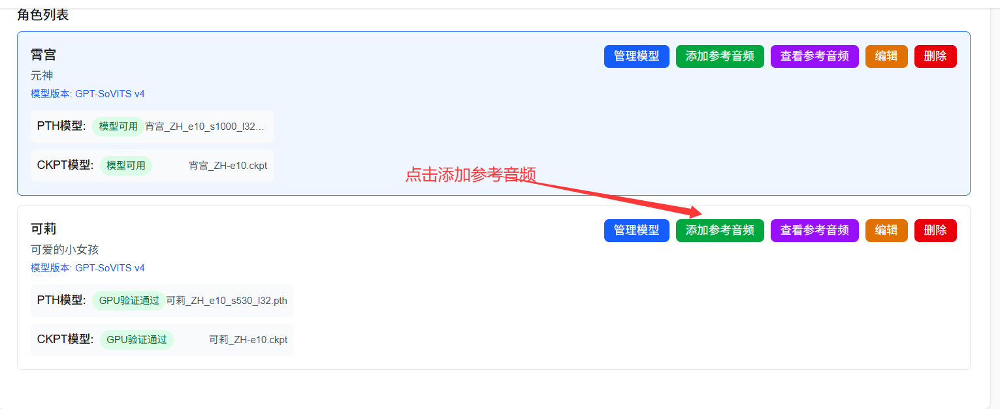

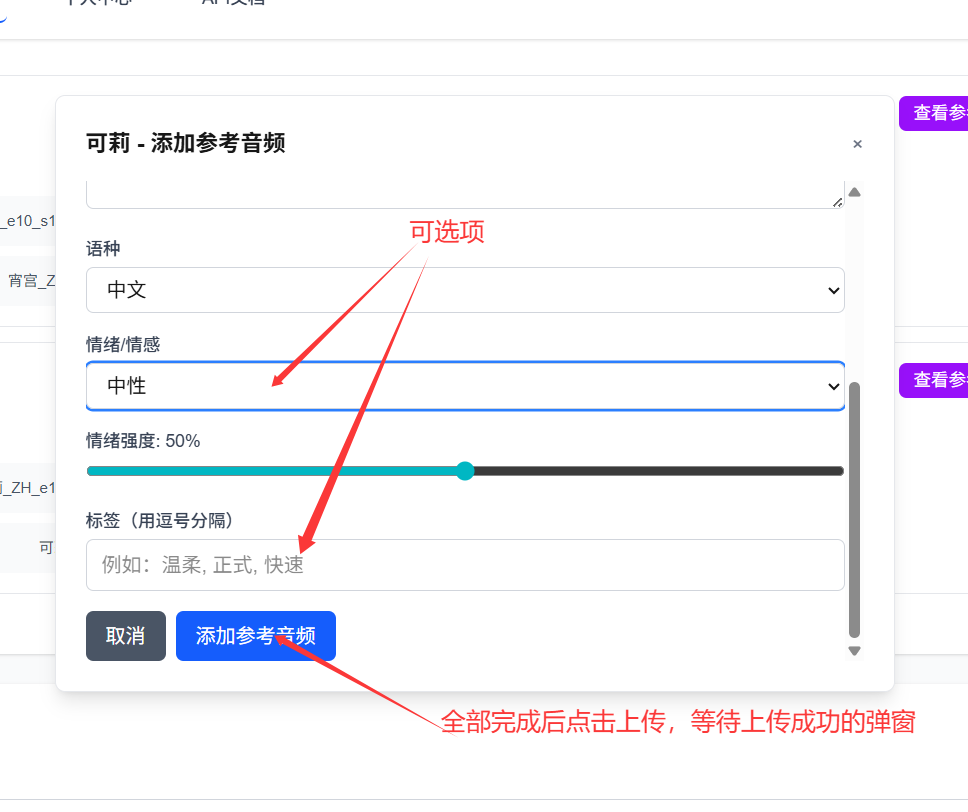

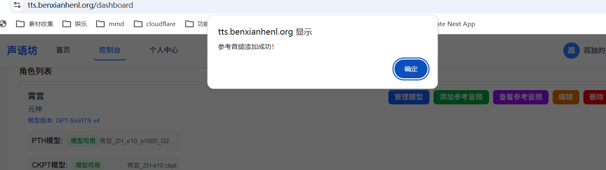

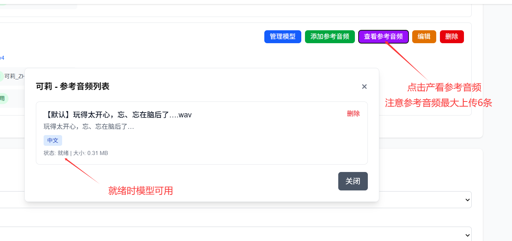

---

### 第四步：等待模型验证

上传模型后，系统会自动进行 GPU 验证，请耐心等待模型状态变为 **"模型可用"**。

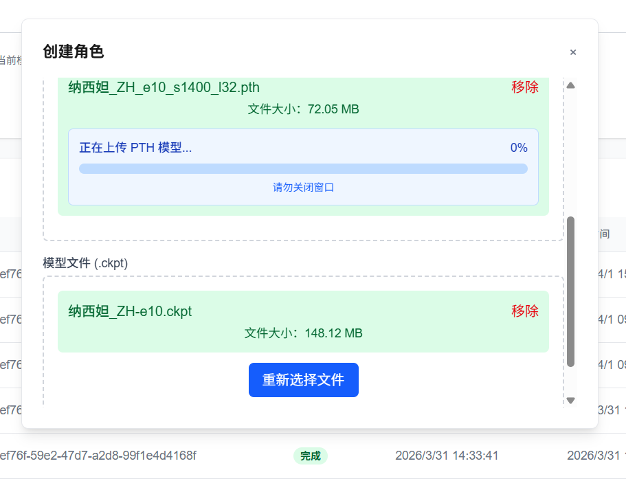

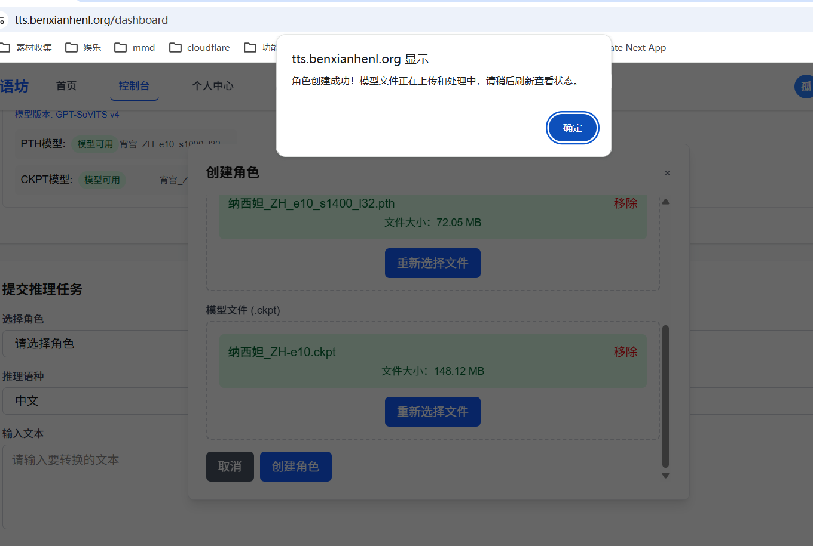

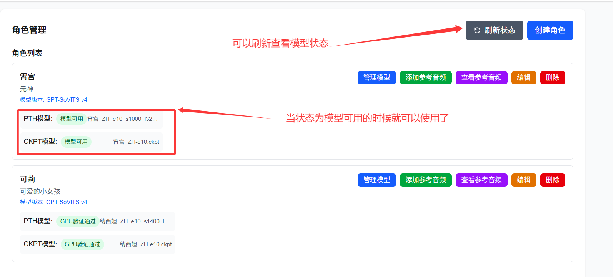

---

### 第五步：获取 API Key

1. 点击右上角用户头像，选择 **"个人中心"**
2. 进入 **"API Key 管理"** 标签页
3. 点击 **"创建 API Key"** 按钮
4. 填写名称（如 "AstrBot"），点击确认
5. **复制生成的 API Key**（注意：只显示一次！）

![API Key 创建截图]
*(请在此处添加 API Key 创建截图)*

![API Key 列表截图]
*(请在此处添加 API Key 列表截图)*

---

### 第六步：配置 AstrBot 插件

#### 6.1 安装插件

1. 将本插件文件夹 `astrbot_plugin_tts_server` 复制到 AstrBot 的 `data/plugins/` 目录
2. 重启 AstrBot

#### 6.2 配置插件

1. 打开 AstrBot 管理面板
2. 进入 **"插件管理"** → 找到 **"TTS 服务器插件"**
3. 点击 **"配置"** 按钮

![AstrBot 插件配置截图]
*(请在此处添加 AstrBot 插件配置界面截图)*

#### 6.3 填写配置项

| 配置项 | 说明 | 示例值 |
|--------|------|--------|
| **client.base_url** | TTS 服务器 API 地址 | `https://benxianhenl.cn/api/proxy` |
| **client.api_key** | 从网站获取的 API Key | `your-api-key-here` |
| **client.timeout** | 请求超时时间（秒） | `60` |
| **default_params.role** | 默认角色名称 | `霄宫` |
| **default_params.reference** | 默认参考音频文件名 | `【默认】哇，你做点心的手艺很不一般啊！去祭典上摆摊的话，肯定会成为最热门的那一个吧！.wav` |
| **default_params.language** | 默认语言 | `zh`（中文） |
| **default_params.speed_factor** | 默认语速 | `1.0` |

![配置填写截图]
*(请在此处添加配置填写完成的截图)*

#### 6.4 保存配置

点击 **"保存"** 按钮，插件会自动加载配置。

---

### 第七步：测试语音合成

配置完成后，你可以在网站控制台测试语音合成：

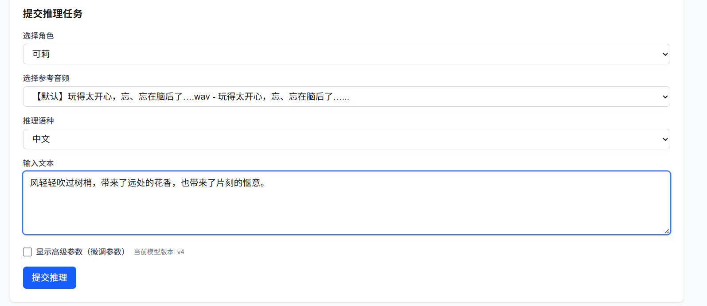

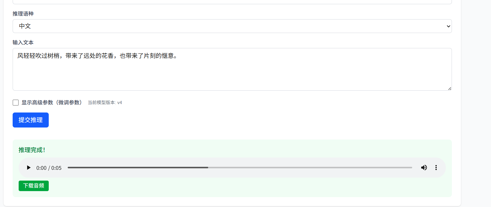

---

## 插件命令

安装并配置完成后，可以使用以下命令：

| 命令 | 说明 | 示例 |
|------|------|------|
| `/说 <文本>` | 直接合成语音 | `/说 你好世界` |
| `/角色列表` | 显示可用角色 | `/角色列表` |
| `/参考音频 <角色名>` | 显示角色的参考音频 | `/参考音频 霄宫` |
| `/TTS缓存` | 显示缓存统计 | `/TTS缓存` |
| `/清除TTS缓存` | 清除所有缓存 | `/清除TTS缓存` |

---

## 情绪配置（高级）

可以在插件配置中添加多套情绪参数，通过触发词自动匹配：

```json
{
  "name": "开心",
  "keywords": ["开心", "高兴", "哈哈"],
  "role": "霄宫",
  "reference": "开心.wav",
  "speed_factor": 1.2
}
```

当 AI 回复包含 "开心"、"高兴" 或 "哈哈" 时，会自动使用这套情绪参数。

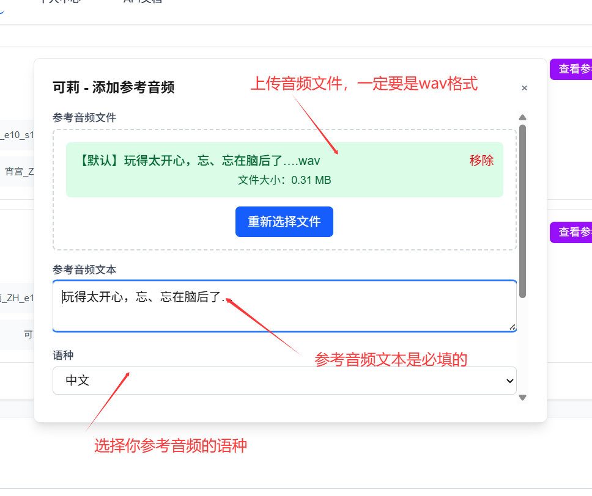

---

## 自动语音转换

插件支持按概率自动将 LLM 回复转为语音：

- **only_llm_result**: 只处理 LLM 返回的消息
- **tts_prob**: 自动转语音的概率（0-1）
- **max_msg_len**: 最大文本长度限制

![自动转换配置截图]
*(请在此处添加自动转换配置截图)*

---

## 常见问题

### Q: 提示 "API Key 无效"？
A: 请检查：
1. API Key 是否复制完整（不要有多余空格）
2. API Key 是否已启用（在个人中心查看状态）
3. base_url 是否正确（应为 `https://benxianhenl.cn/api/proxy`）

### Q: 提示 "角色不存在"？
A: 请检查：
1. 角色名称是否与网站上创建的一致（区分大小写）
2. 使用 `/角色列表` 命令查看可用角色

### Q: 提示 "参考音频不存在"？
A: 请检查：
1. 参考音频文件名是否完整（包含扩展名）
2. 使用 `/参考音频 <角色名>` 命令查看可用参考音频

### Q: 语音合成很慢？
A: 首次合成需要加载模型，会比较慢。后续相同参数的合成都走缓存，速度会很快。

---

## 技术支持

- **网站**: https://benxianhenl.cn/
- **GitHub**: https://github.com/benxianhenl/astrbot_plugin_tts_server
- **问题反馈**: 请在 GitHub Issues 中提交

---

## 许可证

MIT License
